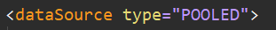
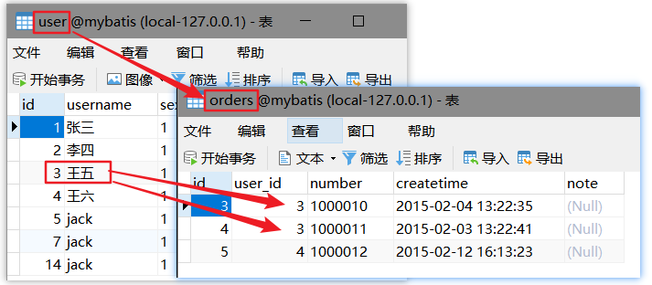
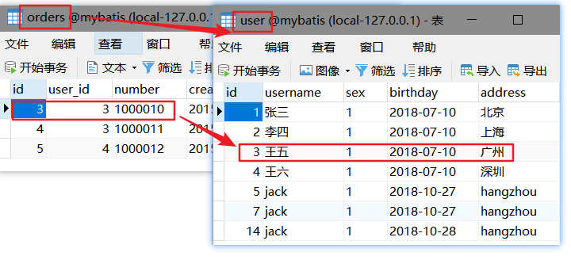

# Mybatis Day03

##1. Mybatis的连接池和事务控制

* **为什么需要使用来连接池技术**
  * 不使用连接池技术,应用查询数据的时候,是直接请求数据库服务器,走的是==TCP==协议,需要进行三次握手和安全认定等操作, 使每次连接都是消耗资源的操作.

* **Mybatis 的连接池配置**

  
  * 当配置如图时 使用的是mybatis自身封装的连接池,

  * 配置为==UNPOOLED== 不使用数据库连接池,(一般不会使用此配置)

  * 配置为==JNDI==  前提是在web项目中使用Mybatis

    *  什么是JNDI

      JNDI:java naming directory interface（java命名目录接口，它是一种服务发布技术），数据源可以以服务的形式发布出去，那么哪个应用想用，就类似于客户端调用远程服务一样去调用即可.

    * 为什么必须是web应用

      往往只有tomcat/weblogic服务器中间件才支持JNDI技术


## 2. Mybatis的动态sql

### 2.1 if 标签

```xml
<if test="条件">
    满足条件需要拼接的sql
</if>
```

### 2.2  where标签

```xml
<!--where标签会自动添加where关键字,
并自动去掉紧跟其后的第一个条件的and或者or-->
<where>
    sql语句,if判断等
</where>
```

### 2.3 sql 片段

```xml
<!--sql标签,抽取sql语句中的公共部分,便于sql语句的共享-->
<sql id="commonSql">
    id,username,address
</sql>
```

* 在同一文件使用抽取的sql片段,使用 `<include>`标签 其参数`refid`指向sql片段的id

  ```xml
  <mapper namespace="com.sunzj.mybatis.mapper.OrdersMapper">
      <select id="queryOrdersWithUser" resultMap="ordersResultMap">
          SELECT
             <include refid="commonInOrders"/>,
              u.username,
              u.address
          FROM
              orders o
              LEFT JOIN `user` u ON o.user_id = u.id
      </select>
      <sql id="commonInOrders">
          o.id oid,
          o.user_id,
          o.number,
          o.createtime,
          o.note
      </sql>
  ```

* 引用其他mapper的sql片段,在refid前加上共享sql片段所在映射文件的namespace

  存有引用的xml

  ```xml
  <mapper namespace="com.sunzj.mybatis.mapper.OrdersMapper">
      <select id="queryOrdersWithUser" resultMap="ordersResultMap">
          SELECT
             <include refid="commonInOrders"/>,
              u.username,
              u.address
          FROM
              orders o
              LEFT JOIN `user` u ON o.user_id = u.id
      </select>
      <sql id="commonInOrders">
          o.id oid,
          o.user_id,
          o.number,
          o.createtime,
          o.note
      </sql>
  ```

  需要引用的写法

  `refid="引用文件的namespace+sql的id"`

  ```xml
   <!--查询所有用户的订单-->
      <select id="queryUserWithOrders" resultMap="UserWithOrdersResultMap">
          SELECT
              u.id,
              u.username,
              u.sex,
              u.birthday,
              u.address,
              <include refid="com.sunzj.mybatis.mapper.OrdersMapper.commonInOrders"/>
          FROM
              `user` u
              LEFT JOIN orders o ON  u.id=o.user_id
      </select>
  ```


### 2.4 foreach 标签

* foreach标签用于多个参数的操作
* 三种方式: 1. 传入list  2. 传入数组  3.  传入封装有数组或list参数的pojo
* 三种方式主要区别在于==collection== 标签的写法
  * 1 传入list ,collection="list" -->固定写法
  * 2 传入数组, collection="arry" --> 固定写法
  * 3 传入pojo  collection="pojo属性名" -->根据pojo中参数数组或者list的属性名称填写

```xml
<!--通过id的list集合查询用户-->
    <select id="queryUserByIds" parameterType="Integer" resultType="user">
        SELECT <include refid="commonSql"/> FROM `user` WHERE id IN
        <foreach collection="list" separator="," open="(" close=")" item="item">
            #{item}
        </foreach>
    </select>

    <!--通过传入的id数组查询用户-->
    <select id="queryUserByIdsArray" parameterType="Integer" resultType="user">
        SELECT <include refid="commonSql"/> FROM `user` WHERE id IN
        <foreach collection="array" separator="," open="(" close=")" item="item">
            #{item}
        </foreach>
    </select>

    <!--按照id查询用户 ,传入参数为pojo-->
    <select id="queryUserByIdsPojo" parameterType="QueryVo" resultType="user">
        SELECT <include refid="commonSql"/> FROM `user` WHERE id IN
        <foreach collection="ids" separator="," open="(" close=")" item="item">
            #{item}
        </foreach>
    </select>
```


## 3. Mybatis的多表关联查询

### 3.1 多表关系分析的技巧



* 从用户表的一条数据看,如图,用户表中id为3的用户王五对应在订单表中可以查到2条订单记录,也就是说,用户表的一条记录可以对应订单表多条记录,也就是说从用户表到订单表是一对多的关系



* 订单表对应user表,订单中的每条数据,都唯一对应user表中的一条用户,每个订单都属于特定的一个用户,所以,从订单表到用户表是一对一的关系
* 对于多对多关系,是==双向的一对多== ,需要中间表进行关联两个表之间的关系.